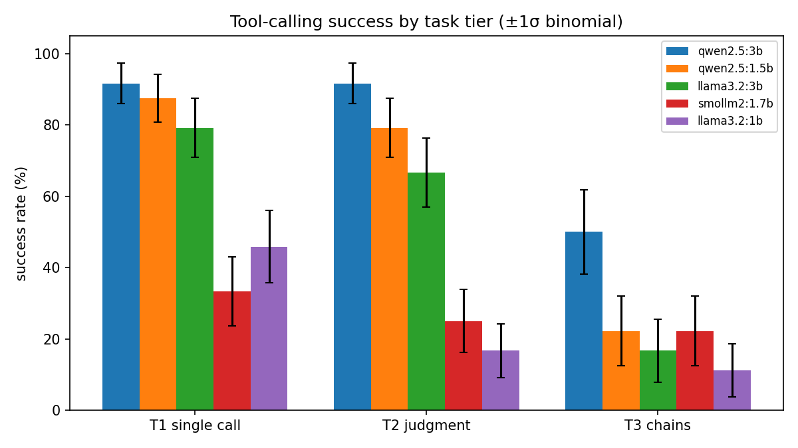

# 🔧 wrenchmark

[](https://github.com/oscartiz/wrenchmark/actions/workflows/ci.yml) [](LICENSE)

**A verifiable tool-calling benchmark for local LLMs.**

How well does an 8B model running on your laptop actually *use tools*? Not "does it produce something that looks like a function call" — does it pick the right tool, extract the right arguments from indirect phrasing, resist calling tools it doesn't need, and chain calls where one result feeds the next?

wrenchmark answers that with a deterministic mock world, programmatically checkable tasks, and a harness you can calibrate before trusting a single number it produces. Everything runs locally against [Ollama](https://ollama.com) — no API keys, no cost.

```bash
pip install -e .
wrenchmark selftest                        # calibrate the harness (no model needed)
wrenchmark run --models hermes3,qwen2.5:7b,llama3.2 --reps 3
wrenchmark report results/results.jsonl    # leaderboard + chart
```

## Design principles

**1. Every task is verifiable — no LLM judges.**
Each task's success criteria are programmatic checks against the episode transcript: *which tools were called, with which arguments, and what the final answer contains*. The mock world is deterministic (the weather in Paris is always 17 °C; ACME always trades at 142.50), so the correct answer to every task is known in advance. No judge model, no rubric ambiguity, no judge bias.

**2. Calibrate the instrument before measuring.**
Every task ships with a `reference` solution — the exact action sequence a perfect agent would take. `wrenchmark selftest` replays all references through the *full* pipeline (provider → agent loop → mock tools → checkers) and requires 100%; it also runs a null baseline (never calls tools, answers unhelpfully) and requires it to fail nearly everything. If the references can't pass or the null agent can, the harness is broken — and you find out before benchmarking anything. This is enforced in CI on every commit.

**3. Measure the model, not the scaffolding.**
The agent loop is deliberately minimal: one neutral system prompt, no retries, no output parsing help, no few-shot examples. Tool errors are fed back verbatim and the model gets to recover (or not). What you measure is the model's tool-calling competence, not the harness author's prompt engineering.

## Task taxonomy

22 tasks across three difficulty tiers (and growing — PRs welcome):

| Tier | What it tests | Example |
|---|---|---|
| **T1 — single call** (8) | Basic mechanics: one tool, arguments stated explicitly | *"What's the current temperature in Paris?"* → `get_weather(city="Paris")` |
| **T2 — judgment** (8) | Argument extraction from indirect phrasing, distractor tools, **knowing when not to call** ("What is the capital of France?" with tools available), graceful handling of tool errors | *"I'm flying to Tokyo tomorrow, what should I pack?"* → infer `get_weather(city="Tokyo")` |
| **T3 — chains** (6) | Multi-step composition: the output of one call is the input of the next | *"What's the email of the head of Engineering?"* → `lookup_department` → `lookup_employee` |

The negative tasks (T2) deserve a note: over-eager tool calling is one of the most common small-model failure modes, and most benchmarks never test for it. Here, calling *any* tool on "What is the capital of France?" is a failure.

## Metrics

Per model, with **±1σ binomial error bars** (each task runs `--reps` times):

- **Success rate** — overall and per tier (all checks pass)
- **Malformed-call rate** — tool calls with invalid JSON, unknown names, or bad argument signatures
- **Mean tool calls & latency** per episode

```
wrenchmark leaderboard
┌──────────────┬─────────┬────────────────┬─────────────┬───────────┬───────────┬─────────────┐
│ model        │ overall │ T1 single call │ T2 judgment │ T3 chains │ malformed │ avg latency │
│ …            │ … ± …   │ …              │ …           │ …         │ …         │ …           │
└──────────────┴─────────┴────────────────┴─────────────┴───────────┴───────────┴─────────────┘
```

`wrenchmark report` writes a markdown leaderboard plus a per-tier chart with error bars to `results/`.

## How it works

```
tasks/*.yaml ──┐
               ▼
        ┌─────────────┐    per episode     ┌──────────────────┐
        │   runner    │ ─────────────────▶ │  agent loop      │
        │ models ×    │                    │  (minimal,       │──▶ mock world
        │ tasks ×reps │ ◀───────────────── │  provider-       │    (deterministic)
        └─────────────┘    transcript      │  agnostic)       │
               │                           └──────────────────┘
               ▼                                    ▲
        checkers (tool_called / tool_not_called /   │ Ollama · OpenAI-compatible ·
        final_answer_contains / max_tool_calls)     │ scripted (references, baselines)
               │
               ▼
        results.jsonl ──▶ scoring (binomial σ) ──▶ leaderboard + chart
```

A task is ~15 lines of YAML:

```yaml
- id: chain-budget
  tier: 3
  prompt: "What is the budget of the department Alice works in?"
  tools: [lookup_employee, lookup_department, calculator]
  checks:
    - {type: tool_called, tool: lookup_employee, args_subset: {name: alice}}
    - {type: tool_called, tool: lookup_department, args_subset: {name: physics}}
    - {type: final_answer_contains, any: ["120000", "120,000"]}
  reference:
    - {tool: lookup_employee, args: {name: Alice}}
    - {tool: lookup_department, args: {name: Physics}}
    - {answer: "Alice works in Physics, which has a budget of 120000 USD."}
```

Checks are deliberately tolerant where formatting doesn't matter (casefolded substring matching for strings, relative tolerance for numbers — `"Paris, France"` matches `paris`) and strict where it does (the right tool, the right argument values, the right final number).

## Results

**5 small local models × 22 tasks × 3 reps (330 episodes), Apple M4 / 16 GB, Ollama 0.30.7, June 2026:**

| Model | Overall | T1 single call | T2 judgment | T3 chains | Malformed calls | Avg latency |
|---|---|---|---|---|---|---|
| qwen2.5:3b | **80% ± 5** | 92% ± 6 | 92% ± 6 | 50% ± 12 | 0.0% | 1.8s |
| qwen2.5:1.5b | 67% ± 6 | 88% ± 7 | 79% ± 8 | 22% ± 10 | 16.9% | 1.2s |
| llama3.2:3b | 58% ± 6 | 79% ± 8 | 67% ± 10 | 17% ± 9 | 0.0% | 2.4s |
| smollm2:1.7b | 27% ± 5 | 33% ± 10 | 25% ± 9 | 22% ± 10 | 0.0% | 2.1s |
| llama3.2:1b | 26% ± 5 | 46% ± 10 | 17% ± 8 | 11% ± 7 | 22.5% | 1.7s |



**Findings:**

- **Only Qwen knows when *not* to call a tool.** On the negative tasks ("What is the capital of France?" with tools available), both Llama 3.2 models and SmolLM2 scored **0/6** — they reach for a tool every single time. The Qwen models resisted 5/6. Over-eager tool calling is the clearest family-level separator in the whole benchmark.
- **Two-hop chains are a wall below ~3B.** Three of the six T3 tasks (`chain-budget`, `chain-head-email`, `chain-time-gym`) were failed by *every* model in *every* rep (0/15 each). Only qwen2.5:3b crossed 50% on chains overall.
- **Failure modes differ by family.** llama3.2:1b often emits the tool call as *JSON text in its answer* instead of a structured call (`{"type":"function","name":"get_weather",...}`) — it knows what a tool call looks like but not how to make one. qwen2.5:1.5b makes structured calls but malforms 17% of them; the 3B variants of both families make essentially zero malformed calls.
- **Speed is not the trade-off.** qwen2.5:1.5b is both the fastest (1.2s/episode) and beats llama3.2:3b, which is twice its size.

Raw episode records, report, and chart for this run are committed under [`benchmarks/2026-06-09-apple-m4/`](benchmarks/2026-06-09-apple-m4/). Reproduce with: `wrenchmark run --models qwen2.5:3b,qwen2.5:1.5b,llama3.2:3b,llama3.2:1b,smollm2:1.7b --reps 3`

Any Ollama model with tool support works out of the box, and any OpenAI-compatible endpoint (llama.cpp server, Together, OpenRouter) via `--provider openai --base-url ...`.

## Installation

```bash
git clone https://github.com/oscartiz/wrenchmark
cd wrenchmark
pip install -e ".[ollama]"     # or ".[openai]" for OpenAI-compatible endpoints
wrenchmark selftest            # verify the harness before benchmarking
```

Requires Python 3.11+. For local runs: [Ollama](https://ollama.com) with a tool-capable model pulled (`ollama pull hermes3`).

## Adding tasks

1. Add a YAML entry to the right tier file in `tasks/` — prompt, tool list, checks, **and a reference solution**.
2. Run `wrenchmark selftest`. If your reference doesn't pass your own checks, the task is fixed before it ever mis-scores a model.
3. The same invariant runs in CI, so the task set can grow without the harness silently rotting.

## Roadmap

- [ ] Published results table for 4–6 local models with analysis of failure modes
- [ ] Failure-mode taxonomy in the report (wrong tool vs. bad args vs. gave up vs. hallucinated answer)
- [ ] Per-task difficulty calibration from observed pass rates
- [ ] Parallel episode execution
- [ ] Token-count accounting via Ollama eval metadata

## Lineage

The agent loop and provider abstraction grew out of [hermes-agent](https://github.com/oscartiz/hermes-agent), my minimal tool-calling agent for local Hermes 3 models. wrenchmark inverts it: instead of an agent that uses tools, a harness that measures how well agents use them.

## License

MIT
